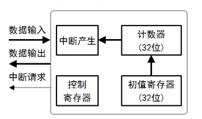
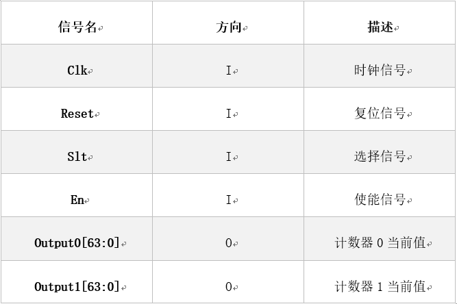

# Verilog 计数器

  

1. 在任意一个时钟上升沿到来的时候，如果复位信号有效，则将两个计数器同时清零；
    
    在满足1时，即使2的条件满足，也不必执行2；

    注意：复位操作也会复位每个计数器当前的有效时钟周期；初始时每个计数器的值都为 0。

2. 每个时钟上升沿到来的时候，如果使能信号有效，则称其为一个“有效时钟周期”，如果：

    2.1. 选择信号为0，则将这个有效时钟信号计入计数器0，每经过1个属于计数器0的有效时钟周期，计数器0累加1；

    2.2 选择信号为1，则将这个有效时钟信号计入计数器1，每经过4个属于计数器1的有效时钟周期，计数器1累加1；

# 端口设计

