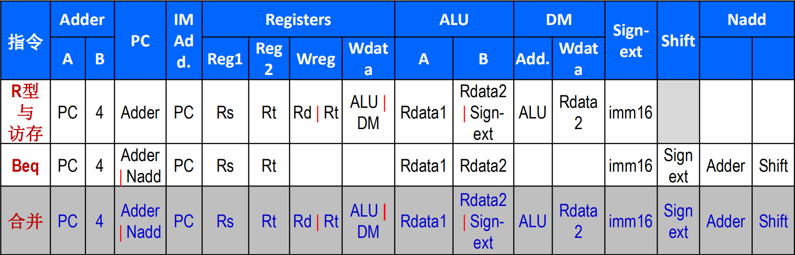

# CPU设计文档

## 设计与测试说明

+ 处理器为 32 位单周期处理器，应支持的指令集为：add, sub, ori, lw, sw, beq, lui, nop，其中：
  + nop 为空指令，机器码 0x00000000，不进行任何有效行为（修改寄存器等）。
add, sub 按无符号加减法处理（不考虑溢出）。

  + 需要采用模块化和层次化设计。顶层有效的驱动信号要求包括且仅包括异步复位信号 reset（clk 请使用内置时钟模块）。
  
+ 通过课下测试并不意味着你的设计完全不存在问题，建议自行构造测试用例以验证设计的正确性（如果进行了相关工作，请写入设计文档，课上问答时将酌情加分）。

output: Instr: 32 位指令信号  
        RegWrite: GRF 写入控制信号  
        RegAddr: GRF 5 位写入地址 
        RegData: GRF 32 位写入数据  
        MemWrite: DM 写入控制信号 
        MemAddr: DM 5 位写入地址  
        MemData: DM 32 位写入数据 

---
## 模块设计-数据通路



### IFU（取指令单元）

+ PC（程序计数器）PC 用寄存器实现，应具有异步复位功能，复位值为起始地址。 
起始地址：0x00000000。
+ IM（指令存储器）用 ROM 实现，容量为 32bit × 32字。IM 实际地址宽度仅为 5 位
+ 相关逻辑 恰当的方法将 PC 中储存的地址同 IM 联系起来。

reset next_pc clk

### GRF（通用寄存器组，也称为寄存器文件、寄存器堆） 

+ 用具有写使能的寄存器实现，寄存器总数为 32 个，应具有异步复位功能。
+ 0 号寄存器的值始终保持为 0。其他寄存器初始值（复位后）均为 0，无需专门设置。

reset RegWrite RegAddr RegData A1 A2

### ALU（算术逻辑单元） 

提供 32 位加、减、或运算及大小比较功能。
加减法按无符号处理（不考虑溢出）。

input
a b ALU_op

### DM（数据存储器）

使用 RAM 实现，容量为 32bit × 32字，应具有异步复位功能，复位值为 0x00000000。
起始地址：0x00000000。
RAM 应使用双端口模式，即设置 RAM 的 Data Interface 属性为 Separate load and store ports。

reset
MemWrite: DM 写入控制信号
MemAddr: DM 5 位写入地址
MemData: DM 32 位写入数据

### EXT（扩展单元）

可以使用 Logisim 内置的 Bit Extender。

---

## 模块设计-Controller（控制器）

add, sub, ori, lw, sw, beq, lui, nop，

| 控制信号 | R/I               | ALU_op | RegWrite | ori      | lw_or_sw    | MemWrite | beq      | lui      |
| -------- | ----------------- | ------ | -------- | -------- | ----------- | -------- | -------- | -------- |
| 含义     | GRF写入寄存器选择 | ALU_op | GRF读写  | ori时为1 | lw或sw时为1 | MemWrite | beq时为1 | lui时为1 |
Tips：上表中，对应指令不注明的控制信号都为0

                                                      
ALU_op 对应的 +-|compare

add GPR[rd] <- GPR[rs] + GPR[rt] R/I=0 ALU_op=0 RegWrite=1 

sub GPR[rd] <- GPR[rs] - GPR[rt] R/I=0 ALU_op=1 RegWrite=1 

ori GPR[rt] <- GPR[rs] | zero_extend(immediate) R/I=1 ori=1 ALU_op=2 RegWrite=1 

lw  GPR[rt] <- memory[GPR[base]+offset] R/I=1 ALU_op=0 lw_or_sw=1 RegWrite=1

sw  memory[GPR[base]+offset] <- GPR[rt] MemWrite=1 lw_or_sw=1 ALU_op=0

beq ALU_op=3 beq=1 
``` 
if (GPR[rs] == GPR[rt]) PC <- PC + 4 + sign_extend(offset||00) else PC <- PC + 4
```

lui GPR[rt] <- immediate || 1'b0{16} R/I=1 lui=1 RgeWrite=1

nop pc <- pc + 4 (其余上述指令略写该步)

<!--
 | 指令                    | pc   | rd         | rs         | rt         | alu |     |
 | ----------------------- | ---- | ---------- | ---------- | ---------- | --- | --- |
 | R类型 add sub nop       | pc+4 | ins[11-15] | ins[16-20] | ins[21-25] |     |     |
 | I类型 ori lw sw beq lui |      |            |            |            |     |     |
 | J类型                   |      |            |            |            |     |     |
-->

---

## 思考题
1. 上面我们介绍了通过 FSM 理解单周期 CPU 的基本方法。请大家指出单周期 CPU 所用到的模块中，哪些发挥状态存储功能，哪些发挥状态转移功能。
   
    状态存储功能：pc寄存器 GRF寄存器堆 data memory  
    状态转移功能：ALU算术逻辑单元 EXT扩展单元 IFU取指令单元 

2. 现在我们的模块中 IM 使用 ROM， DM 使用 RAM， GRF 使用 Register，这种做法合理吗？ 请给出分析，若有改进意见也请一并给出。
   
   IM修改少，使用ROM可以在断电后保持内容  
   DM修改较多，使用RAM作为内存可频繁读写，速度较快  
   GRF规模小，使用读写最多，故用速度最快的Register，但是成本高  

3. 在上述提示的模块之外，你是否在实际实现时设计了其他的模块？如果是的话，请给出介绍和设计的思路。        
  add, sub, ori, lw, sw, beq, lui, nop，  
  + 扩展器 EXT 有 ori 的 ，beq 的 signed_EXT_2，lui 的 zero_EXT_16  
  + splitter 解析指令为 op6 rs5 rt5 rd5 shamt5 func5 imm16 j_address26。可拓展性。将op和func作为controller的输入，产生控制信号  
    R/I ALU_op RegWrite ori lw_or_sw MemWrite beq lui   
   
1. 事实上，实现 nop 空指令，我们并不需要将它加入控制信号真值表，为什么？
   
   nop指令的对应的控制信号都为0，不对GRF和DM产生影响，只有pc<-pc+4

2. 上文提到，MARS 不能导出 PC 与 DM 起始地址均为 0 的机器码。实际上，可以避免手工修改的麻烦。请查阅相关资料进行了解，并阐释为了解决这个问题，你最终采用的方法。

3. 阅读 Pre 的 “MIPS 指令集及汇编语言” 一节中给出的测试样例，评价其强度（可从各个指令的覆盖情况，单一指令各种行为的覆盖情况等方面分析），并指出具体的不足之处。