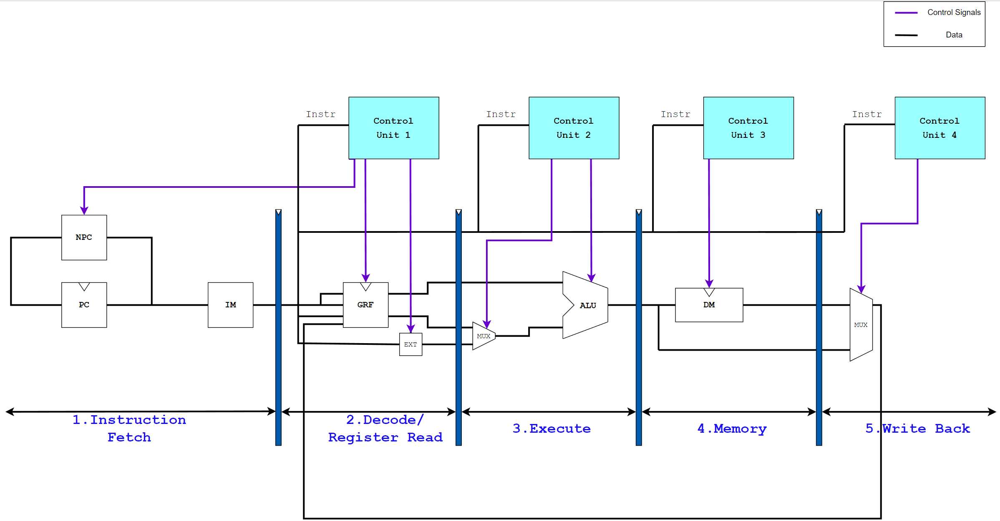

# 五级流水线 CPU 设计方案        

add, sub, ori, lw, sw, beq, lui, jal, jr, nop  
addi  

删除了 reg_write 若reg_addr==0 则不写入

## 指令添加流程

必须确保 CU_D CU_E CU_M CU_W 都完成了指令译码！！！  
本人 CU 缺陷所在，多次复制同样代码  P6重构？ 

1. CU_D
   + 指令译码
   + next_pc_op
   + ext_op
   + Tnew Tuse_rs Tuse_rt 分析 
   + stall fwd 处理

2.  

## 设计流程   

1. 流水线寄存器+单指令功能  
2. 阻塞实现   

    没注明的Tuse为3如sll的Tuse_rs
    |    instr_D     |  reg  | Tuse  |
    | :------------: | :---: | :---: |
    |      beq       | rs/rt |   0   |
    | cal_r - sll_rs | rs/rt |   1   |
    |     cal_i      |  rs   |   1   |
    |      load      |  rs   |   1   |
    |     store      |  rs   |   1   |
    |     store      |  rt   |   2   |
    
    只需考虑 Tnew_E 运算得 Tnew_M Tnew_W 恒等于0
    | instr_D | Tnew  |
    | :-----: | :---: |
    |   beq   |   0   |
    |  cal_r  |   1   |
    |  cal_i  |   1   |
    |  load   |   1   |
    |  store  |   1   |
    |  store  |   2   |

    stall不判断reg_write(若不可写则reg_addr=0)

    冒险控制模块合并于CU_D中

    为了方便处理，课程组要求阻塞是指将指令阻塞在 D 级。
    当一个指令到达 D 级后，我们需要将它的 Tuse值与后面每一级的 Tnew进行比较（当然还有 AA 值的校验），
    当 Tuse < Tnew 时，我们需要阻塞流水线。
    阻塞的实现需要改造流水线寄存器和 PC ，我们需要让它们具有以下功能：

    + 冻结 PC 的值；
    + 冻结 D 级流水线寄存器的值；
    + 将 E 级流水线寄存器清零（这等价于在instr_D前插入了一个 nop 指令）。
    此外，还有一个考虑，就是复位信号和阻塞信号的优先级问题。请仔细设计信号的优先级来保证流水线的正确性。

3. GRF内部转发实现
4. 转发实现     
    
    + 罗列需求者流水寄存器 rs rt      

        |     D     |     E     |     M     |
        | :-------: | :-------: | :-------: |
        | rs_data_D | rs_data_E | rt_data_M |
        | pc E_reg  | ALU M_reg | DM W_reg  |
        | rt_data_D | rt_data_E |           |
        | pc E_reg  | ALU M_reg |           |

    + 各级供给者流水线寄存器选择转发结果 MUX_1      

        add, sub, ori, lw, sw, beq, lui, jal, jr, nop       
        供给者  
        ```verilog
        assign give_E = pc_E + 32'd8;

        assign give_M = (give_M_op == 1'b1) ? alu_out_M : pc_M + 8;
        
        MUX_8 u_MUX_8_give_W (
        .sel  (give_W_op),
        .data2(dm_out_W),
        .data1(alu_out_W),
        .data0(pc_W + 32'd8),

        .ans(give_W)
        );
        ```

    + 需求者流水线寄存器从其后级的接收到的转发结果中选择 MUX_2
         
   
5. 测试优化

    lui计算可在D的EXT内完成 但我在ALU中完成     
    NPC 可以分离到 D 层中

在设计时，可以利用这一点，按照流水级的顺序对每一级的流水寄存器进行实例化，然后在其间插入相应级的模块，并用注释清晰地注明各级起始位置。
另外，也可以考虑增加模块层次，将每一流水级的各个模块放入一个父级模块中调用，可以将复杂度有效分散到各个层级。

## stage_F
PC  （涵盖NPC模块）
IM  

## stage_D
D_reg       
rs rt转发
CU_D     
GRF 读取部分
EXT 默认符号扩展imm

## stage_E
E_reg
rs rt转发
give_E
CU_E
ALU (rs rt ext alu_op)

## stage_M
M_reg
give_M
CU_M
DM display 输出`字地址`而非`字节地址`
## stage_W
W_reg
give_W
cu_W
MUX_8_GRF_reg_data

## CU 概述

分布式译码：每一级都部署一个控制器，负责译出当前级所需控制信号。这种方法较为灵活，“现译现用”有效降低了流水级间传递的信号量，但是需要实例化多个控制器，增加了后续流水级的逻辑复杂度。

控制信号驱动型：为每个指令定义一个 wire 型变量，使用或运算描述组合逻辑，对每个控制信号进行单独处理。这种方法在指令数量较多时适用，且代码量易于压缩，缺陷是如错添或漏添了某条指令，很难锁定出现错误的位置。

指令存储器（IM，instruction memory）和数据存储器（DM，data memory）要求如下：

IM：容量为 16KiB（4096 × 32bit）。
DM：容量为 12KiB（3072 × 32bit）。
PC 的初始地址为 0x00003000，和 Mars 中我们要求设置的代码初始地址相同。


  


# 思考题

1、我们使用提前分支判断的方法尽早产生结果来减少因不确定而带来的开销，但实际上这种方法并非总能提高效率，请从流水线冒险的角度思考其原因并给出一个指令序列的例子。
    
    提前判断可能需要阻塞
```mips
    ori $t0, $0, 1
    ori $t1, $0, 2
    beq $t0, $t1, lable
    nop
```

2、因为延迟槽的存在，对于 jal 等需要将指令地址写入寄存器的指令，要写回 PC + 8，请思考为什么这样设计？

    $31内的指令应当是延迟槽内指令的下一条指令，而非延迟槽

3、我们要求大家所有转发数据都来源于流水寄存器而不能是功能部件（如 DM 、 ALU ），请思考为什么？

    这样是单周期的实现，流水线变单周期，效率降低

4、我们为什么要使用 GPR 内部转发？该如何实现？

    W存储和D读取同时进行时，保证D读取到的是W存储的内容。

```verilog
assign rs_data = (reg_addr == rs & rs != 5'd0) ? reg_data : registers[rs];
assign rt_data = (reg_addr == rt & rt != 5'd0) ? reg_data : registers[rt];
```

5、我们转发时数据的需求者和供给者可能来源于哪些位置？共有哪些转发数据通路？

    需求者
    |     D     |     E     |     M     |
    | :-------: | :-------: | :-------: |
    | rs_data_D | rs_data_E | rt_data_M |
    | rt_data_D | rt_data_E |           |

    供给者
```verilog
        assign give_E = pc_E + 32'd8;
        assign give_M = (give_M_op == 1'b1) ? alu_out_M : pc_M + 8;
        MUX_8 u_MUX_8_give_W (
        .sel  (give_W_op),
        .data2(dm_out_W),
        .data1(alu_out_W),
        .data0(pc_W + 32'd8),

        .ans(give_W)
        );
```
    转发数据通路：需求者端口的根据流水线优先级选择fwd_MUX 供给者端口的根据指令选择give_MUX

6、在课上测试时，我们需要你现场实现新的指令，对于这些新的指令，你可能需要在原有的数据通路上做哪些扩展或修改？提示：你可以对指令进行分类，思考每一类指令可能修改或扩展哪些位置。

    add, sub, ori, lw, sw, beq, lui, jal, jr, nop

```verilog
    wire cal_r = (add | sub | sll);
    wire cal_i = (ori | lui);
    wire load = lw;
    wire store = sw;
```
    | cal_r             | 修改alu     |
    | ----------------- | ----------- |
    | cal_i             | 修改ext alu |
    | 寄存器分支 beq    | 修改pc      |
    | 跳转imm并链接 jal | 修改pc      |
    | 跳转寄存器 jr     |             |

7、简要描述你的译码器架构，并思考该架构的优势以及不足。

    分布式 信号驱动型 cu_D包含主要冲突处理  
    优势 逻辑较为清晰
    不足 分为4个CU 修改dubug复杂

1、[P5 选做] 请详细描述你的测试方案及测试数据构造策略。

2、[P5、P6 选做] 请评估我们给出的覆盖率分析模型的合理性，如有更好的方案，可一并提出。